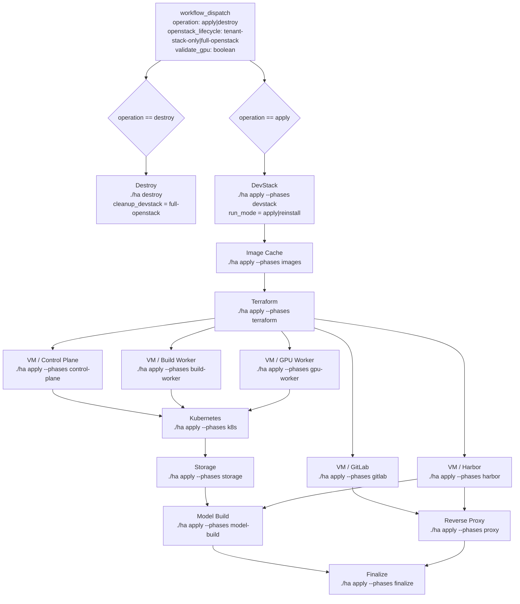
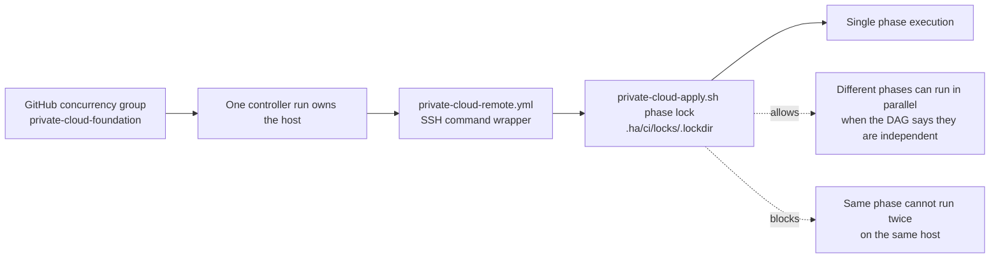
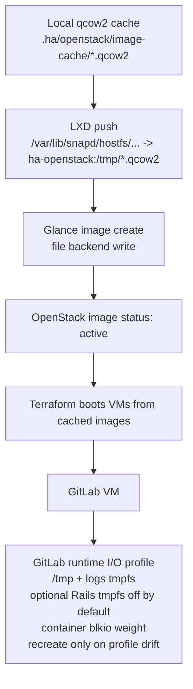

# Private Cloud Actions Architecture

This document records the current private-cloud controller structure and the
local validation rule for future changes.

## Controller DAG

## Mutual Exclusion

Rules:

- Do not dispatch remote apply or destroy before the equivalent local command
  has passed.
- Do not commit or push provisioning changes if the local full rebuild fails.
- Keep `devstack`, `images`, and `terraform` serialized.
- Run VM role phases as separate jobs after Terraform so logs are split by role.
- Run `k8s` only after control-plane, build-worker, and gpu-worker are ready.
- Run `model-build` only after storage and Harbor are ready.
- Run `proxy` only after GitLab and Harbor are ready.

## Image And GitLab I/O

Observed local full rebuild notes:

- The image phase reuses local qcow2 files when the cache hits.
- A full OpenStack rebuild removes the DevStack container and Glance backend,
  so cached images must still be uploaded into the new Glance service.
- Large Glance uploads are storage-bound and should be treated as the main
  image-phase I/O bottleneck.
- GitLab runtime I/O mitigation is applied during the GitLab bootstrap phase,
  not while uploading the GitLab base image into Glance.
- GitLab keeps `/tmp` and logs on tmpfs by default, limits Docker logs, and
  applies a lower container blkio weight. Rails tmpfs is off by default because
  it invalidates boot caches and makes cold starts CPU-bound.
- GitLab reapply must not recreate the container when the image and I/O profile
  already match; otherwise every apply pays the full Omnibus/Rails cold-start
  cost.
