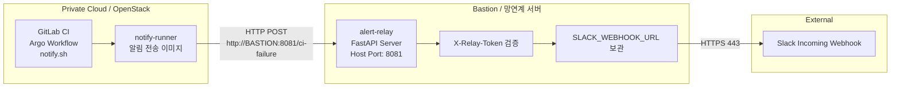

# infra-alert-images 기반 GitLab CI Slack 알림 구성

## 1. 목적

`infra-alert-images` 디렉토리는 폐쇄망 또는 Private Cloud 환경에서 GitLab CI/CD 알림을 외부 Slack Webhook으로 안전하게 전달하기 위한 알림용 컨테이너 이미지 구성을 담고 있다.

이 구조의 핵심 목적은 다음과 같다.

```text
Private GitLab CI / Argo Workflow / notify.sh
    → 내부 HTTP POST
    → Bastion 또는 망연계 서버의 alert-relay
    → 외부 HTTPS POST
    → Slack Webhook
````

Private 쪽 서버나 GitLab Runner Pod가 Slack Webhook URL을 직접 알지 않도록 분리하고, Slack Webhook Secret은 Bastion 또는 망연계 서버에만 보관한다.

즉, Private 영역에서는 내부 API인 `alert-relay`만 호출하고, 실제 Slack Webhook 호출은 `alert-relay` 컨테이너가 담당한다.

---

## 2. 이미지 구성

`infra-alert-images`에는 알림 흐름을 구성하는 2개의 이미지가 있다.

| 이미지             | 실행 위치                                 | 역할                                |
| --------------- | ------------------------------------- | --------------------------------- |
| `notify-runner` | GitLab Runner Job / Argo Workflow Job | CI 성공/실패 이벤트를 `alert-relay`로 POST |
| `alert-relay`   | Bastion / 망연계 서버 / 필요 시 Control VM    | 이벤트를 수신하고 Slack Webhook으로 전달      |

---

## 3. 전체 흐름



---

## 4. 이미지 Pull 전략

폐쇄망에서는 이미지를 직접 빌드하지 않고, 인터넷 가능 환경에서 미리 빌드한 이미지를 사용한다.

권장 흐름은 다음과 같다.

```text
인터넷 가능 환경
  docker build
  docker push Docker Hub

        ↓

Harbor Docker Hub Proxy Cache
  Docker Hub 이미지 캐싱

        ↓

폐쇄망 GitLab Runner / Bastion
  Harbor 경로로 이미지 Pull 및 실행
```

예시 이미지 경로:

```text
Docker Hub:
jeongseungmin/notify-runner:latest
jeongseungmin/alert-relay:latest

Harbor Proxy Cache:
harbor.intp.me/docker-hub/jeongseungmin/notify-runner:latest
harbor.intp.me/docker-hub/jeongseungmin/alert-relay:latest
```

---

# 5. notify-runner 이미지

## 5.1 역할

`notify-runner`는 GitLab CI Job 또는 Argo Workflow Job 안에서 실행되는 알림 전송용 이미지다.

이 이미지는 Slack Webhook을 직접 호출하지 않는다.

대신 GitLab CI 환경 변수와 알림 상태를 수집한 뒤, 내부 `alert-relay` API로 JSON payload를 POST한다.

동작 흐름은 다음과 같다.

```text
1. GitLab CI 환경 변수 수집
2. NOTIFY_STATUS 확인
3. NOTIFY_SUMMARY 또는 ci_error_summary.txt 기반 summary 생성
4. alert-relay 엔드포인트로 JSON payload POST
```

---

## 5.2 주요 환경변수

| 변수명                  | 설명                      | 예시                                  |
| -------------------- | ----------------------- | ----------------------------------- |
| `ALERT_RELAY_URL`    | alert-relay API 주소      | `http://<Bastion-IP>:8081/ci-failure` |
| `ALERT_RELAY_TOKEN`  | alert-relay와 공유하는 인증 토큰 | `<relay-token>`                     |
| `NOTIFY_STATUS`      | 알림 상태                   | `success`, `failed`, `warning`      |
| `NOTIFY_SUMMARY`     | 직접 지정할 알림 요약문           | `Harbor to ECR push 완료`             |
| `ERROR_SUMMARY_FILE` | 실패 로그 요약 파일 경로          | `ci_error_summary.txt`              |

권장 엔드포인트는 다음과 같다.

```env
ALERT_RELAY_URL=http://<Bastion-IP>:8081/ci-failure
```

하위호환이 필요한 경우 다음 엔드포인트도 사용할 수 있다.

```env
ALERT_RELAY_URL=http://<Bastion-IP>:8081/ci-failure
```

---

## 5.3 GitLab CI/CD Variables

GitLab CI/CD Variables에는 다음 값만 등록한다.

```text
ALERT_RELAY_URL=http://<Bastion-IP>:8081/ci-failure
ALERT_RELAY_TOKEN=<relay-token>
```

중요하게도 GitLab Variables에는 `SLACK_WEBHOOK_URL`을 넣지 않는다.

`SLACK_WEBHOOK_URL`은 반드시 `alert-relay`가 실행되는 Bastion 또는 망연계 서버에만 둔다.

---

## 5.4 GitLab CI 사용 예시

현재 CI 코드 기준으로 `notify-success`, `notify_failure` Job은 `notify-runner` 이미지를 사용하고 `/usr/local/bin/notify.sh`를 실행한다.

```yaml
notify-success:
  stage: notify
  image:
    name: harbor.intp.me/docker-hub/jeongseungmin/notify-runner:latest
    entrypoint: [""]
  script:
    - |
      if [ "${CI_PIPELINE_SOURCE:-}" = "trigger" ] || [ "${CI_PIPELINE_SOURCE:-}" = "api" ]; then
        export NOTIFY_SUMMARY="${MODEL_IMAGE_NAME:-unknown} Harbor to ECR push 완료. tag=${IMAGE_TAG:-unknown}"
      else
        export NOTIFY_SUMMARY="사설망 베이스 이미지 빌드 및 Trivy 스캔 완료"
      fi
      export NOTIFY_STATUS="success"
      /usr/local/bin/notify.sh
  when: on_success
  allow_failure: true
  tags:
    - gpu-worker

notify_failure:
  stage: notify
  image:
    name: harbor.intp.me/docker-hub/jeongseungmin/notify-runner:latest
    entrypoint: [""]
  script:
    - NOTIFY_STATUS=failed /usr/local/bin/notify.sh
  when: on_failure
  allow_failure: true
  tags:
    - gpu-worker
```

---

## 5.5 notify-runner 동작 규칙

`notify-runner`는 다음 기준으로 동작한다.

1. `ALERT_RELAY_URL`이 없으면 알림 전송을 생략한다.
2. `ALERT_RELAY_TOKEN`이 없으면 알림 전송을 생략한다.
3. `NOTIFY_SUMMARY`가 있으면 해당 값을 우선 사용한다.
4. `NOTIFY_SUMMARY`가 없고 `ERROR_SUMMARY_FILE`이 있으면 파일 내용을 사용한다.
5. 실패 로그 파일이 길 경우 마지막 일부만 요약해서 전송한다.
6. Slack Webhook URL은 절대 직접 사용하지 않는다.

---

# 6. alert-relay 이미지

## 6.1 역할

`alert-relay`는 Bastion, 망연계 서버, 또는 필요 시 Control VM에서 실행되는 내부 알림 중계 서버다.

Private 영역에서 들어온 CI 이벤트를 수신하고, 토큰 검증 후 Slack Incoming Webhook으로 최종 알림을 전송한다.

동작 흐름은 다음과 같다.

```text
1. /ci-failure 요청 수신
2. X-Relay-Token Header 검증
3. payload의 status 값 확인
4. Slack 메시지 포맷 생성
5. Slack Incoming Webhook으로 HTTPS POST
```

---

## 6.2 제공 엔드포인트

| Method | Endpoint      | 설명                 |
| ------ | ------------- | ------------------ |
| `GET`  | `/health`     | health check       |
| `POST` | `/ci-failure`   | 성공/실패/경고 공통 이벤트 수신 |
| `POST` | `/ci-failure` | 하위호환용 실패 이벤트 수신    |

권장 사용 엔드포인트는 `/ci-failure`이다.

`/ci-failure`는 기존 실패 알림 스크립트와의 호환을 위해 유지한다.

---

## 6.3 Relay Token 생성

`alert-relay`는 내부 API를 아무나 호출하지 못하도록 토큰 기반 인증을 사용한다.

Bastion 또는 관리 PC에서 다음 명령으로 토큰을 생성한다.

```bash
openssl rand -hex 32
```

예시 출력:

```text
6a1a1056790a61d26b4253c65d193b4d704826c60fc277193efc27594845d175
```

이 값은 다음 두 곳에 동일하게 설정한다.

```text
Bastion alert-relay 컨테이너:
RELAY_TOKEN=<relay-token>

GitLab CI/CD Variables:
ALERT_RELAY_TOKEN=<relay-token>
```

정리하면 다음과 같다.

| 위치                     | 변수명                 | 값                             |
| ---------------------- | ------------------- | ----------------------------- |
| Bastion / alert-relay  | `RELAY_TOKEN`       | `openssl rand -hex 32`로 생성한 값 |
| GitLab CI/CD Variables | `ALERT_RELAY_TOKEN` | 위와 동일한 값                      |

주의:

* 토큰 값은 Git 저장소에 커밋하지 않는다.
* GitLab CI/CD Variables에는 Masked / Protected 설정을 권장한다.
* Slack Webhook URL과 Relay Token은 서로 다른 Secret이다.
* Slack Webhook URL은 Bastion에만 두고, GitLab에는 넣지 않는다.

---

## 6.4 컨테이너 실행 예시

Bastion 또는 망연계 서버에서 다음과 같이 실행한다.

```bash
docker run -d \
  --name alert-relay \
  --restart unless-stopped \
  -p 8081:8080 \
  -e ALERT_RELAY_HOST="0.0.0.0" \
  -e ALERT_RELAY_PORT="8080" \
  -e RELAY_TOKEN="<relay-token>" \
  -e SLACK_WEBHOOK_URL="<slack-webhook-url>" \
  harbor.intp.me/docker-hub/jeongseungmin/alert-relay:latest
```

이 예시는 다음과 같은 의미다.

```text
Host Port: 8081
Container Port: 8080
```

따라서 Private VM 또는 Runner Pod에서는 다음 주소로 호출한다.

```text
http://<Bastion-IP>:8081/ci-failure
```

---

## 6.5 docker compose 예시

```yaml
services:
  alert-relay:
    image: harbor.intp.me/docker-hub/jeongseungmin/alert-relay:latest
    container_name: alert-relay
    restart: unless-stopped
    ports:
      - "8081:8080"
    environment:
      ALERT_RELAY_HOST: "0.0.0.0"
      ALERT_RELAY_PORT: "8080"
      RELAY_TOKEN: "<relay-token>"
      SLACK_WEBHOOK_URL: "<slack-webhook-url>"
```

---

## 6.6 health check

Bastion 내부에서 확인한다.

```bash
curl http://127.0.0.1:8081/health
```

정상 응답 예시:

```json
{"status":"ok","service":"alert-relay"}
```

Private VM 또는 GitLab Runner Pod에서 확인한다.

```bash
curl http://<Bastion-IP>:8081/health
```

---

## 6.7 수동 이벤트 테스트

성공 이벤트 테스트:

```bash
curl -X POST "http://<Bastion-IP>:8081/ci-failure" \
  -H "Content-Type: application/json" \
  -H "X-Relay-Token: <relay-token>" \
  -d '{
    "project": "hybrid-ai-serving-platform",
    "project_path": "SGS-Strategy/hybrid-ai-serving-platform",
    "job": "manual-success-test",
    "stage": "notify",
    "status": "success",
    "branch": "main",
    "commit": "abc1234",
    "pipeline_url": "http://gitlab.local/pipeline/success",
    "job_url": "http://gitlab.local/job/success",
    "summary": "manual success event test"
  }'
```

실패 이벤트 테스트:

```bash
curl -X POST "http://<Bastion-IP>:8081/ci-failure" \
  -H "Content-Type: application/json" \
  -H "X-Relay-Token: <relay-token>" \
  -d '{
    "project": "hybrid-ai-serving-platform",
    "project_path": "SGS-Strategy/hybrid-ai-serving-platform",
    "job": "manual-failed-test",
    "stage": "notify",
    "status": "failed",
    "branch": "main",
    "commit": "abc1234",
    "pipeline_url": "http://gitlab.local/pipeline/failed",
    "job_url": "http://gitlab.local/job/failed",
    "summary": "manual failed event test"
  }'
```

하위호환 `/ci-failure` 테스트:

```bash
curl -X POST "http://<Bastion-IP>:8081/ci-failure" \
  -H "Content-Type: application/json" \
  -H "X-Relay-Token: <relay-token>" \
  -d '{
    "project": "hybrid-ai-serving-platform",
    "project_path": "SGS-Strategy/hybrid-ai-serving-platform",
    "job": "legacy-failure-test",
    "stage": "notify",
    "branch": "main",
    "commit": "abc1234",
    "pipeline_url": "http://gitlab.local/pipeline/legacy",
    "job_url": "http://gitlab.local/job/legacy",
    "error_summary": "legacy ci-failure compatibility test"
  }'
```

---

# 7. 네트워크 및 포트 정책

## 7.1 Bastion에 alert-relay를 둘 경우

| 정책          | Source                 | Destination            |       Port | Direction            | Purpose                                      |
| ----------- | ---------------------- | ---------------------- | ---------: | -------------------- | -------------------------------------------- |
| ALLOW       | `10.42.0.0/24`         | `<Bastion-IP>` | TCP `8081` | Private VM → Bastion | GitLab CI / Argo / notify.sh 알림 전송           |
| ALLOW, 필요 시 | `<POD_CIDR>`           | `<Bastion-IP>` | TCP `8081` | Pod → Bastion        | Runner Pod 또는 Argo Pod Source가 Pod IP로 보일 경우 |
| ALLOW       | `<Bastion-IP>` | `hooks.slack.com`      |  TCP `443` | Bastion → Slack      | Slack Webhook 호출                             |
| DENY        | `0.0.0.0/0`            | `<Bastion-IP>` | TCP `8081` | Internet → Bastion   | 외부 직접 접근 차단                                  |
| DENY 권장     | Private VM 대역          | `hooks.slack.com`      |  TCP `443` | Private → Slack      | Private 서버의 직접 Slack 접근 차단                   |

---

## 7.2 Control VM에 alert-relay를 둘 경우

Bastion 서버에 이미 많은 프로세스가 있어 운영 부담이 크다면, `alert-relay`를 Control VM에 배치할 수도 있다.

이 경우 구조는 다음과 같다.

```text
Private GitLab CI / Argo Workflow
    → Control VM alert-relay
    → Bastion 또는 Gateway 경유
    → Slack Webhook
```

필요 정책은 다음과 같다.

| 구분      | 정책          | Source            | Destination                       |       Port | Direction               | Purpose                     |
| ------- | ----------- | ----------------- | --------------------------------- | ---------: | ----------------------- | --------------------------- |
| Ingress | ALLOW       | `10.42.0.0/24`    | `<CONTROL_VM_IP>`                 | TCP `8081` | Private VM → Control VM | alert-relay 호출              |
| Ingress | ALLOW, 필요 시 | `<POD_CIDR>`      | `<CONTROL_VM_IP>`                 | TCP `8081` | Pod → Control VM        | Runner Pod / Argo Pod 알림 전송 |
| Egress  | ALLOW       | `<CONTROL_VM_IP>` | `<Bastion-IP>` 또는 Gateway |  TCP `443` | Control VM → Bastion    | 외부 Slack 경유                 |
| Egress  | ALLOW       | Bastion           | `hooks.slack.com`                 |  TCP `443` | Bastion → Slack         | 최종 Slack Webhook 호출         |
| Ingress | DENY        | `0.0.0.0/0`       | `<CONTROL_VM_IP>`                 | TCP `8081` | Internet → Control VM   | 외부 직접 접근 차단                 |

---

# 8. alert-relay 사용 시 주의 사항

## 8.1 Slack Webhook Secret은 Bastion에만 둔다

GitLab CI/CD Variables, Argo Workflow, Runner Pod에는 Slack Webhook URL을 넣지 않는다.

허용되는 구조:

```text
GitLab Runner:
- ALERT_RELAY_URL
- ALERT_RELAY_TOKEN

Bastion alert-relay:
- RELAY_TOKEN
- SLACK_WEBHOOK_URL
```

금지되는 구조:

```text
GitLab Runner:
- SLACK_WEBHOOK_URL
```

Slack Webhook URL이 GitLab Job 로그나 CI 변수에 노출되면 Secret 관리 목적이 사라진다.

---

## 8.2 인증 Header 이름을 통일한다

`alert-relay` 호출 시 인증 Header는 다음을 사용한다.

```text
X-Relay-Token: <relay-token>
```

과거 문서나 테스트 코드에 `X-Alert-Token`이 남아 있을 수 있으므로 주의한다.

최종 기준은 다음과 같다.

```text
Header: X-Relay-Token
Environment:
- Runner: ALERT_RELAY_TOKEN
- Relay: RELAY_TOKEN
```

---

## 8.3 엔드포인트를 통일한다

권장 엔드포인트는 `/ci-failure`이다.

```text
POST /ci-failure
```

`/ci-failure`는 기존 실패 알림 호환을 위한 엔드포인트로만 사용한다.

```text
POST /ci-failure
```

헬스체크는 다음을 사용한다.

```text
GET /health
```


---

## 8.4 Host Port와 Container Port를 구분한다

최종 기준은 다음이다.

```bash
-p 8081:8080
```

의미는 다음과 같다.

```text
Host Port: 8081
Container Port: 8080
```

따라서 GitLab CI/CD Variable의 `ALERT_RELAY_URL`에는 반드시 Host Port인 `8081`을 사용한다.

```text
ALERT_RELAY_URL=http://<Bastion-IP>:8081/ci-failure
```

---

## 8.5 Pod에서 Bastion 접근이 실패할 수 있다

GitLab Runner Pod에서 `alert-relay` 호출이 timeout되는 경우, URL이나 Header 문제가 아니라 Pod egress NAT 문제일 수 있다.

대표적인 증상:

```text
curl: (28) Failed to connect to <Bastion-IP> port 8081
```

확인된 장애 사례에서는 Runner Pod의 Source IP가 Node IP로 SNAT되지 않고 Pod IP 그대로 Bastion으로 나갔다.

예시:

```text
Runner Pod IP: 192.168.251.181
Build Node IP: 10.42.0.5
Bastion IP: 192.168.0.30

실제 패킷:
192.168.251.181 > 192.168.0.30:8081
```

기대했던 정상 흐름은 다음과 같다.

```text
Runner Pod
192.168.251.181
    ↓ SNAT / MASQUERADE
Build Node
10.42.0.5
    ↓
Bastion
192.168.0.30:8081
```

하지만 실제로는 다음처럼 Pod IP가 그대로 나가면서 Bastion 또는 중간 라우터가 응답 경로를 찾지 못해 timeout이 발생했다.

```text
Runner Pod
192.168.251.181
    ↓ SNAT 안 됨
Bastion
192.168.0.30:8081
```

---

## 8.6 Calico IPPool과 LAN 대역 중복을 주의한다

장애 원인은 Calico IPPool과 실제 LAN 대역이 겹친 것이었다.

문제 구조:

```text
Calico IPPool: 192.168.0.0/16
Bastion LAN IP: 192.168.0.30
```

Calico는 일반적으로 다음 조건에서 Pod 트래픽을 MASQUERADE한다.

```text
Source가 Calico IPPool 안에 있고,
Destination이 Calico IPPool 밖에 있을 때 MASQUERADE
```

그런데 Bastion IP `192.168.0.30`이 Calico IPPool `192.168.0.0/16` 안에 포함되기 때문에, Calico는 해당 트래픽을 외부망으로 보지 않고 MASQUERADE하지 않았다.

결과적으로 Pod IP가 Node IP로 변환되지 않아 Bastion 응답 경로 문제가 발생했다.

---

## 8.7 임시 조치: 특정 트래픽만 강제 MASQUERADE

긴급하게 Runner Pod에서 Bastion alert-relay로 접근해야 한다면, Build Node에 다음 iptables 룰을 임시 적용할 수 있다.

```bash
sudo iptables -t nat -I POSTROUTING 1 \
  -s 192.168.251.128/26 \
  -d 192.168.0.30/32 \
  -p tcp --dport 8081 \
  -j MASQUERADE
```

이 룰의 의미는 다음과 같다.

```text
Source: Runner Pod 대역
Destination: Bastion alert-relay IP
Port: TCP 8081
Action: MASQUERADE
```

적용 후 Runner Pod에서 다시 확인한다.

```bash
curl -v --connect-timeout 5 http://192.168.0.30:8081/health
```

정상 응답:

```json
{"status":"ok","service":"alert-relay"}
```

단, 이 방식은 임시 조치다.

노드 재부팅, Calico 재시작, 노드 재구성 시 사라질 수 있으므로 장기 대책은 별도로 필요하다.

---

## 8.8 장기 조치: Pod CIDR과 LAN 대역 분리

장기적으로는 Calico Pod CIDR과 실제 LAN 대역이 겹치지 않도록 재설계하는 것이 좋다.

문제 구조:

```text
Calico IPPool: 192.168.0.0/16
LAN/Bastion: 192.168.0.0/24
```

권장 구조:

```text
Calico IPPool: 10.244.0.0/16
또는
Calico IPPool: 172.20.0.0/16
```

또는 Bastion alert-relay를 Calico IPPool과 겹치지 않는 별도 대역으로 제공할 수도 있다.

예시:

```text
Bastion alert-relay: 10.x.x.x:8081
또는
Bastion alert-relay: 172.16.x.x:8081
```

---

# 9. 장애 확인용 명령어

알림이 오지 않을 때는 다음 순서로 확인한다.

## 9.1 alert-relay 컨테이너 상태 확인

```bash
docker ps
docker logs -f alert-relay
```

## 9.2 Bastion 내부 health check

```bash
curl http://127.0.0.1:8081/health
```

## 9.3 Private VM에서 접근 확인

```bash
curl http://<Bastion-IP>:8081/health
```

## 9.4 Runner Pod 내부에서 접근 확인

```bash
curl -v --connect-timeout 5 http://<Bastion-IP>:8081/health
```

## 9.5 Runner Pod IP 확인

```bash
hostname -i
ip addr
ip route
ip route get <Bastion-IP>
```

## 9.6 Build Node에서 tcpdump 확인

```bash
sudo tcpdump -ni any host <Bastion-IP> and port 8081
```

정상적인 경우 Bastion으로 나가는 Source가 Node IP로 보여야 한다.

비정상적인 경우 Pod IP가 그대로 보일 수 있다.

```text
비정상 예시:
Pod IP > Bastion IP:8081
```

---

# 10. 재빌드 및 Push 방법

## 10.1 notify-runner 빌드

```bash
cd infra-alert-images/notify-runner

docker build -t jeongseungmin/notify-runner:latest .
docker push jeongseungmin/notify-runner:latest
```

## 10.2 alert-relay 빌드

```bash
cd infra-alert-images/alert-relay

docker build -t jeongseungmin/alert-relay:latest .
docker push jeongseungmin/alert-relay:latest
```

## 10.3 Harbor Proxy Cache Pull 확인

```bash
docker pull harbor.intp.me/docker-hub/jeongseungmin/notify-runner:latest
docker pull harbor.intp.me/docker-hub/jeongseungmin/alert-relay:latest
```

---

# 11. 최종 운영 체크리스트

## GitLab CI 쪽

* [ ] `notify-runner` 이미지를 사용하고 있는가?
* [ ] `ALERT_RELAY_URL`이 `http://<Bastion-IP>:8081/ci-failure`로 설정되어 있는가?
* [ ] `ALERT_RELAY_TOKEN`이 등록되어 있는가?
* [ ] GitLab Variables에 `SLACK_WEBHOOK_URL`이 들어가 있지 않은가?
* [ ] 성공 job은 `when: on_success`인가?
* [ ] 실패 job은 `when: on_failure`인가?
* [ ] 알림 job은 `allow_failure: true`로 설정되어 있는가?

## Bastion / alert-relay 쪽

* [ ] `alert-relay` 컨테이너가 실행 중인가?
* [ ] Host Port `8081`이 방화벽에서 허용되어 있는가?
* [ ] 컨테이너 실행 옵션이 `-p 8081:8080`인가?
* [ ] `RELAY_TOKEN`이 설정되어 있는가?
* [ ] `SLACK_WEBHOOK_URL`이 설정되어 있는가?
* [ ] `GET /health`가 정상 응답하는가?
* [ ] Bastion에서 `hooks.slack.com:443`으로 나갈 수 있는가?

## 네트워크 쪽

* [ ] Private VM에서 Bastion alert-relay로 접근 가능한가?
* [ ] Runner Pod에서 Bastion alert-relay로 접근 가능한가?
* [ ] Pod 접근만 실패한다면 tcpdump로 Source IP를 확인했는가?
* [ ] Calico IPPool과 Bastion LAN 대역이 겹치지 않는가?
* [ ] 임시 MASQUERADE 룰이 필요한 상황인가?

---

# 12. 최종 요약

`infra-alert-images`는 폐쇄망 GitLab CI/CD 알림을 안전하게 외부 Slack으로 전달하기 위한 2개 이미지 구성이다.

```text
notify-runner
- GitLab CI / Argo Workflow 안에서 실행
- 성공/실패 이벤트를 alert-relay로 POST
- Slack Webhook URL을 직접 알지 않음

alert-relay
- Bastion / 망연계 서버에서 실행
- X-Relay-Token 검증
- Slack Webhook URL을 보관
- Slack Incoming Webhook으로 최종 알림 전송
```

최종 포트 기준은 다음과 같다.

```text
Container Port: 8080
Host Port: 8081
GitLab 호출 URL:
http://<Bastion-IP>:8081/ci-failure
```

권장 알림 경로는 다음과 같다.

```text
GitLab CI / Argo Workflow
  → notify-runner
  → http://<Bastion-IP>:8081/ci-failure
  → alert-relay
  → https://hooks.slack.com
  → Slack Channel
```

가장 중요한 운영 원칙은 다음 4가지다.

1. Slack Webhook URL은 Bastion 또는 alert-relay 실행 서버에만 둔다.
2. Private Runner는 `ALERT_RELAY_URL`과 `ALERT_RELAY_TOKEN`만 사용한다.
3. `ALERT_RELAY_URL`의 포트는 Host Port인 `8081`을 사용한다.
4. Runner Pod에서 timeout이 발생하면 URL보다 먼저 Pod egress NAT/SNAT 문제를 의심한다.

```
