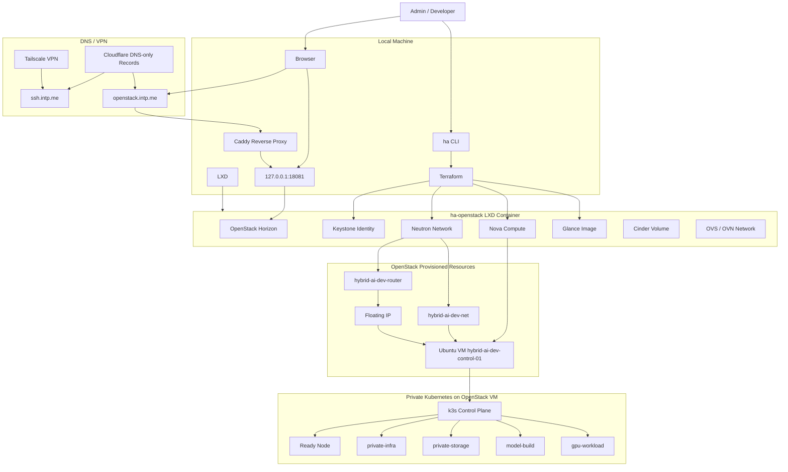

# Admin Entrypoints and Private Cloud Architecture

이 문서는 현재 로컬에서 실행 중인 Private Cloud Foundation의 관리자 진입점,
각 기술의 역할, 전체 구조를 정리합니다.

`ha`와 `HA_*` prefix는 Hybrid AI 프로젝트 이름을 뜻하며, High Availability 약자가 아닙니다.

## 관리자 진입점

| 대상 | 진입점 | 용도 | 계정 또는 접속 방법 |
| --- | --- | --- | --- |
| OpenStack Horizon | `http://127.0.0.1:18081/dashboard/` | OpenStack 웹 관리자 콘솔 | Domain `Default`, User `admin`, Password `hybrid-ai-devstack` |
| OpenStack Horizon via Caddy | `http://openstack.intp.me/dashboard/` 또는 HTTPS profile 적용 후 `https://openstack.intp.me/dashboard/` | VPN 사용자용 관리자 콘솔 | Cloudflare DNS-only + Caddy reverse proxy |
| SSH to physical server | `ssh.intp.me` | 물리 서버 SSH 진입점 | Tailscale VPN 연결 후 SSH |
| Future Kubernetes UI | `k8s.intp.me` | Kubernetes 관리자 UI 예약 | Dashboard/API UI 설치 후 upstream 연결 |
| Future Grafana | `grafana.intp.me` | Monitoring UI 예약 | Monitoring stack 설치 후 upstream 연결 |
| Future ArgoCD | `argocd.intp.me` | GitOps UI 예약 | ArgoCD 설치 후 upstream 연결 |
| OpenStack CLI/API | `source .ha/openstack-local/openrc.sh` | VM, 네트워크, 이미지, 보안그룹 확인 | `openstack server list` 등 |
| Kubernetes Admin | OpenStack VM SSH 접속 | k3s cluster 관리 | `ubuntu@<CONTROL_PLANE_FLOATING_IP>` via LXD proxy |
| k3s kubectl | VM 내부 | Kubernetes node, pod, namespace 확인 | `sudo k3s kubectl ...` |
| Terraform | `infra/private-cloud/openstack` | OpenStack 리소스 IaC 관리 | `./ha tf output`, `./ha up openstack` |
| Hybrid AI CLI | `./ha` 또는 설치 후 `ha` | 테스트, 프로비저닝, 검증 자동화 | 프로젝트 전용 CLI |

## OpenStack Horizon 접속

브라우저에서 아래 주소로 접속합니다.

```txt
http://127.0.0.1:18081/dashboard/
```

로그인 정보:

```txt
Domain: Default
User: admin
Password: hybrid-ai-devstack
```

`127.0.0.1:18081`은 LXD proxy device를 통해 `ha-openstack` 컨테이너의 Horizon으로 연결됩니다.
DNS를 붙인 뒤에는 Caddy가 `openstack.intp.me` 요청을 같은 upstream으로 reverse proxy합니다.

## Kubernetes 접속

현재 Kubernetes Dashboard는 설치하지 않았습니다. Kubernetes 관리는 SSH와 `k3s kubectl`로 수행합니다.

```sh
ssh \
  -o ProxyCommand='lxc exec ha-openstack -- nc %h %p' \
  -i .ha/ssh/hybrid-ai-private-admin \
  ubuntu@<CONTROL_PLANE_FLOATING_IP>
```

VM 접속 후 확인:

```sh
sudo k3s kubectl get nodes
sudo k3s kubectl get pods -A
sudo k3s kubectl get ns
```

현재 확인된 주요 상태:

```txt
hybrid-ai-dev-control-01   Ready   control-plane,etcd
private-infra              Active
private-storage            Active
model-build                Active
gpu-workload               Active
```

## 기술별 역할

| 기술 | 현재 역할 |
| --- | --- |
| LXD | 로컬에서 OpenStack DevStack을 띄우는 컨테이너 런타임 |
| DevStack | 개발 및 검증용 OpenStack control plane |
| OpenStack Keystone | 인증, project, user 관리 |
| OpenStack Nova | VM 생성 및 관리 |
| OpenStack Neutron | network, subnet, router, floating IP 관리 |
| OpenStack Glance | Ubuntu/Cirros VM image 저장 |
| OpenStack Cinder | block storage 서비스 검증 |
| Horizon | OpenStack 웹 관리자 콘솔 |
| Caddy | `openstack.intp.me` 등 관리자 HTTP/HTTPS 진입점 reverse proxy |
| Cloudflare DNS | `ssh.intp.me`와 관리자 서비스 도메인을 물리 서버 Tailscale IP로 연결 |
| Tailscale | public internet에 origin을 열지 않고 VPN 사용자만 접근하게 하는 사설 접속 경로 |
| Terraform | OpenStack 리소스 선언형 프로비저닝 |
| Ubuntu Cloud Image | Kubernetes node로 사용할 VM OS |
| k3s | OpenStack VM 위에 올라간 Private Kubernetes |
| kubectl | Kubernetes 관리자 CLI |
| ha CLI | Hybrid AI 프로젝트 전용 실행, 검증, 프로비저닝 CLI |

## 구조도



## 현재 한계

현재 구성은 로컬 DevStack 기반 end-to-end 검증 환경입니다.
production 기준으로는 아직 아래 항목이 남아 있습니다.

- control-plane 3대 이상
- worker node 분리
- replicated 또는 external default StorageClass
- IngressClass
- cert-manager
- monitoring stack
- backup target 또는 backup controller
