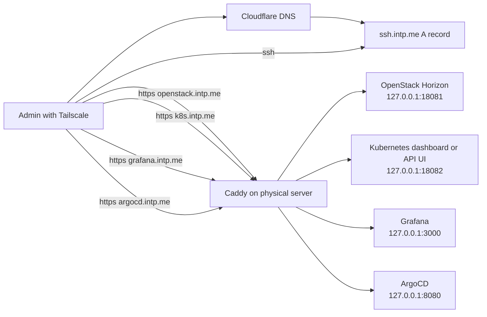

# Private Cloud Reverse Proxy

이 디렉터리는 물리 서버에 들어온 HTTP/HTTPS 요청을 Private Cloud 관리자 서비스로
분기하는 Caddy 설정과 Cloudflare DNS 자동화 스크립트를 관리합니다.

현재 Private Kubernetes는 k3s입니다. Caddy는 k3s를 대체하지 않고, 물리 서버 앞단의
관리자 reverse proxy 역할만 맡습니다. k3s 내부에 Grafana, ArgoCD, Kubernetes Dashboard
같은 서비스가 올라가면 Caddy upstream을 해당 서비스의 NodePort, port-forward, 또는
내부 ingress 경로로 연결합니다.

## 목표 구조

`ssh.intp.me`는 물리 서버의 Tailscale IP를 직접 가리키고, 나머지 서비스 도메인은
같은 서버를 가리키되 Caddy가 Host header 기준으로 upstream을 나눕니다.



## DNS 레코드

Cloudflare record는 모두 DNS-only로 둡니다. Tailscale IP는 Cloudflare edge에서
접근할 수 있는 public origin이 아니므로 orange-cloud proxy를 켜면 안 됩니다.

| 이름 | 타입 | 값 | Cloudflare proxy |
| --- | --- | --- | --- |
| `ssh.intp.me` | `A` | 물리 서버 Tailscale IPv4 | off |
| `openstack.intp.me` | `CNAME` | `ssh.intp.me` | off |
| `k8s.intp.me` | `CNAME` | `ssh.intp.me` | off |
| `grafana.intp.me` | `CNAME` | `ssh.intp.me` | off |
| `argocd.intp.me` | `CNAME` | `ssh.intp.me` | off |

## 로컬 환경 변수

공개해도 큰 문제가 없는 DNS 이름과 upstream port는 `.env`에 둡니다.
토큰은 `.env.secret`에 둡니다.

```sh
HA_BASE_DOMAIN=intp.me
HA_TAILSCALE_IP=100.64.0.10
HA_OPENSTACK_DOMAIN=openstack.intp.me
HA_K8S_DOMAIN=k8s.intp.me
HA_GRAFANA_DOMAIN=grafana.intp.me
HA_ARGOCD_DOMAIN=argocd.intp.me
HA_OPENSTACK_HORIZON_UPSTREAM=127.0.0.1:18081
CLOUDFLARE_API_TOKEN=...
CLOUDFLARE_ZONE_ID=...
```

## Caddy 실행

내부 HTTP 검증만 할 때는 기본 Caddyfile을 씁니다.

```sh
caddy validate --config infra/private-cloud/reverse-proxy/Caddyfile
caddy run --config infra/private-cloud/reverse-proxy/Caddyfile
```

Cloudflare DNS-01로 HTTPS 인증서를 자동 발급하려면 Cloudflare DNS provider가 포함된
Caddy binary가 필요합니다.

```sh
xcaddy build --with github.com/caddy-dns/cloudflare
sudo install -m 755 caddy /usr/local/bin/caddy
source .env
source .env.secret
sudo --preserve-env=HA_CADDY_ACME_EMAIL,HA_OPENSTACK_DOMAIN,HA_K8S_DOMAIN,HA_GRAFANA_DOMAIN,HA_ARGOCD_DOMAIN,HA_OPENSTACK_HORIZON_UPSTREAM,HA_K8S_DASHBOARD_UPSTREAM,HA_GRAFANA_UPSTREAM,HA_ARGOCD_UPSTREAM,CLOUDFLARE_API_TOKEN \
  caddy run --config infra/private-cloud/reverse-proxy/Caddyfile.cloudflare
```

## Cloudflare DNS 동기화

로컬에서 미리보기:

```sh
source .env
source .env.secret
python3 infra/private-cloud/reverse-proxy/cloudflare_dns.py
```

실제 적용:

```sh
python3 infra/private-cloud/reverse-proxy/cloudflare_dns.py --apply
```

GitHub Actions에서는 `.github/workflows/private-cloud-dns.yml`을 수동 실행합니다.
`apply=false`가 기본값이라 먼저 dry-run을 확인하고, 문제가 없으면 `apply=true`로 다시 실행합니다.

## Cloudflare API token 권한

필요한 token은 하나면 됩니다.

| 항목 | 값 |
| --- | --- |
| Token type | Custom token |
| Zone scope | Include `intp.me` zone only |
| Permissions | `Zone:Read`, `DNS:Edit` |
| Account permissions | 필요 없음 |
| User permissions | 필요 없음 |

권한 상세:

| 권한 | 필요한 이유 |
| --- | --- |
| `Zone:Read` | `intp.me` zone 접근 검증과 zone metadata 조회 |
| `DNS:Edit` | `ssh`, `openstack`, `k8s`, `grafana`, `argocd` record 생성/수정 |
| `DNS:Edit` | Caddy DNS-01 인증서 발급 시 `_acme-challenge` TXT record 생성/삭제 |

권한 생성 절차:

1. Cloudflare dashboard에서 `My Profile` -> `API Tokens` -> `Create Token` -> `Custom token`.
2. Token name은 `hybrid-ai-private-cloud-dns`처럼 용도를 드러내는 이름으로 지정.
3. Permissions에 `Zone / Zone / Read`, `Zone / DNS / Edit`만 추가.
4. Zone Resources는 `Include / Specific zone / intp.me`로 제한.
5. Client IP filtering은 GitHub-hosted runner를 쓰면 빼둡니다. Self-hosted runner 고정 IP를 쓸 때만 제한합니다.
6. TTL 또는 만료일은 팀 운영 기준에 맞춰 선택합니다. 만료일을 두면 갱신 일정도 따로 관리해야 합니다.

넣지 말아야 하는 권한:

- `Account:*`
- `User:*`
- `Workers:*`
- `SSL and Certificates:*`
- 모든 zone에 대한 `All zones`

토큰은 DNS record를 수정할 수 있으므로 GitHub Secret 또는 `.env.secret`에만 둡니다.
`CLOUDFLARE_ZONE_ID`는 secret이 아니므로 GitHub Variables 또는 `.env`에 둡니다.

토큰 검증:

```sh
source .env
source .env.secret
curl -fsS \
  -H "Authorization: Bearer ${CLOUDFLARE_API_TOKEN}" \
  -H "Content-Type: application/json" \
  "https://api.cloudflare.com/client/v4/zones/${CLOUDFLARE_ZONE_ID}"
```

참고:

- Cloudflare API token permissions: https://developers.cloudflare.com/fundamentals/api/reference/permissions/
- Cloudflare DNS proxy status: https://developers.cloudflare.com/dns/proxy-status/
- Caddy reverse_proxy: https://caddyserver.com/docs/caddyfile/directives/reverse_proxy
- Caddy environment variables: https://caddyserver.com/docs/caddyfile/concepts#environment-variables
- Caddy DNS challenge: https://caddyserver.com/docs/caddyfile/directives/tls#dns
- Caddy Cloudflare DNS module: https://github.com/caddy-dns/cloudflare
