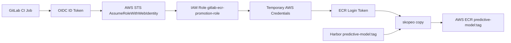

# GitLab OIDC for AWS ECR Promotion

이 디렉터리는 GitLab OIDC 기반 ECR Promotion을 위한 AWS IAM 설정을 설명합니다. 범위는 GitLab CI가 Harbor 이미지를 AWS ECR `predictive-model` 저장소로 promotion 할 때 필요한 GitLab OIDC Provider, GitLab ECR Promotion IAM Role, 해당 trust policy, ECR push inline policy, 그리고 GitLab CI/CD Variable `GITLAB_ECR_PROMOTION_ROLE_ARN`에 한정합니다.

현재 운영 방식에서는 이 GitLab OIDC ECR Promotion IAM 리소스를 관리자가 수동 생성/검토합니다. 이 디렉터리의 Terraform 파일은 같은 구성을 재현하거나, 향후 이 GitLab OIDC 구성을 Terraform 관리 대상으로 전환할 때 참고하는 reference/adoption 용도로 유지합니다.

## 목적

- GitLab CI가 OIDC ID Token을 사용해 AWS STS에서 임시 자격 증명을 발급받도록 구성합니다.
- Harbor -> ECR promotion pipeline에 필요한 최소 IAM 권한만 부여합니다.
- ECR repository 생성 권한은 포함하지 않고, 기존 `predictive-model` repository만 대상으로 제한합니다.
- 기본 private cloud provisioning 흐름에서는 `private/aws-oidc`를 자동 apply 하지 않습니다.

## 전체 흐름

1. GitLab CI Job이 `id_tokens`로 OIDC ID Token을 발급받습니다.
2. Job이 `aws sts assume-role-with-web-identity`로 IAM Role `gitlab-ecr-promotion-role`을 가정합니다.
3. AWS STS가 임시 Access Key / Secret Key / Session Token을 반환합니다.
4. Job이 `aws ecr get-login-password`로 ECR login token을 발급받습니다.
5. `skopeo copy`가 Harbor 이미지를 ECR로 복사합니다.

## Flow



## 현재 운영 범위

- GitLab OIDC Provider
- GitLab ECR Promotion IAM Role
- 해당 Role의 trust policy
- 해당 Role의 ECR push inline policy
- GitLab CI/CD Variable `GITLAB_ECR_PROMOTION_ROLE_ARN`

이 문서는 AWS IAM 전체 운영 정책을 정의하지 않습니다. 현재 수동 생성/검토 절차와 Terraform reference는 위 GitLab OIDC ECR Promotion 리소스 범위에만 적용됩니다.

## Terraform 파일의 역할

- `main.tf`
  - GitLab OIDC Provider, ECR Promotion Role, trust policy, ECR push inline policy의 기준 구성을 표현합니다.
- `variables.tf`
  - GitLab issuer, project/ref 조건, AWS account/region, ECR repository 값을 정의합니다.
- `outputs.tf`
  - GitLab CI/CD에 등록할 `GITLAB_ECR_PROMOTION_ROLE_ARN` 값을 확인하는 용도입니다.
- `backend.tf`
  - 향후 이 GitLab OIDC 구성을 Terraform 관리 대상으로 전환할 때 S3 remote state를 사용하기 위한 backend 선언입니다.
- `backend.example.hcl`
  - 향후 adoption/import 시 사용할 remote state 예시입니다.

이 파일들은 현재 기본 GitHub Actions private cloud provisioning 흐름에서 자동 실행되지 않습니다.

## 수동 생성/검토 기준

### 1. GitLab OIDC Provider

- Provider URL: `https://gitlab.intp.me`
- Audience: `sts.amazonaws.com`
- Provider ARN: `arn:aws:iam::808379768010:oidc-provider/gitlab.intp.me`

### 2. GitLab ECR Promotion IAM Role

- Role name: `gitlab-ecr-promotion-role`
- Role ARN: `arn:aws:iam::808379768010:role/gitlab-ecr-promotion-role`

Trust Policy 기준:

- Principal Federated:
  - `arn:aws:iam::808379768010:oidc-provider/gitlab.intp.me`
- Action:
  - `sts:AssumeRoleWithWebIdentity`
- Condition:
  - `gitlab.intp.me:aud = sts.amazonaws.com`
  - `gitlab.intp.me:sub = project_path:3stacks/predictor-model:ref_type:branch:ref:main`

### 3. ECR Push Inline Policy

- Policy name: `gitlab-ecr-promotion-role-policy`
- `ecr:GetAuthorizationToken`은 Resource `*`
- ECR push 관련 권한은 `arn:aws:ecr:ap-northeast-2:808379768010:repository/predictive-model`로 제한
- `ecr:CreateRepository`는 부여하지 않음

허용 대상 액션:

- `ecr:BatchCheckLayerAvailability`
- `ecr:BatchGetImage`
- `ecr:CompleteLayerUpload`
- `ecr:DescribeImages`
- `ecr:DescribeRepositories`
- `ecr:GetDownloadUrlForLayer`
- `ecr:InitiateLayerUpload`
- `ecr:ListImages`
- `ecr:PutImage`
- `ecr:UploadLayerPart`

### 4. GitLab CI/CD Variables

GitLab CI/CD에는 아래 값을 등록해 사용합니다.

- `GITLAB_ECR_PROMOTION_ROLE_ARN`
- `AWS_REGION`
- `AWS_ACCOUNT_ID`
- `ECR_ENDPOINT`
- `ECR_REPOSITORY`
- `ECR_REGISTRY_ID`

변수 정책:

- `AWS_ROLE_ARN`은 GitHub Actions 자체 AssumeRole 용도와 충돌할 수 있으므로 GitLab ECR Promotion 용도로 사용하지 않습니다.
- `AWS_ACCESS_KEY_ID`와 `AWS_SECRET_ACCESS_KEY`는 GitLab ECR Promotion 인증 변수로 사용하지 않습니다.
- `AWS_SESSION_TOKEN`이 기존에 등록되어 있었다면 제거하고, 없었다면 새로 등록하지 않습니다.
- GitLab OIDC 방식에서는 CI Job 런타임에 AWS STS가 임시 `AWS_ACCESS_KEY_ID`, `AWS_SECRET_ACCESS_KEY`, `AWS_SESSION_TOKEN`을 발급하고 job 내부에서만 export 합니다.

## 기본 실행 정책

- 기본 private cloud provisioning 흐름에서는 `private/aws-oidc`를 자동 apply 하지 않습니다.
- `./ha apply`와 `Private Cloud Controller` 기본 DAG는 현재 `private/openstack` Terraform을 중심으로 동작합니다.
- `private/aws-oidc`는 GitLab OIDC ECR Promotion 구성을 설명하고 재현하기 위한 별도 reference/adoption 모듈입니다.
- 현재 `private-cloud-apply.sh`와 `.github/workflows/private-cloud-remote.yml`은 AWS IAM 리소스를 생성하지 않고, GitLab CI 설정에 필요한 `GITLAB_ECR_PROMOTION_ROLE_ARN` 전달만 유지합니다.

## 향후 Terraform 관리로 전환하는 경우

현재 기본 운영에서는 GitLab OIDC ECR Promotion IAM 구성을 관리자가 수동 생성/검토합니다. 향후 이 GitLab OIDC ECR Promotion 구성을 Terraform 관리 대상으로 전환하려면, 먼저 S3 remote state를 연결한 뒤 기존 콘솔 리소스를 import 해서 같은 state로 관리해야 합니다.

### Remote State

GitHub Actions 같은 일회성 실행 환경에서 local state를 사용하면 매 실행마다 state가 비어 있는 상태로 시작할 수 있습니다. 그 상태에서 `private/aws-oidc`를 바로 apply 하면 기존 GitLab OIDC Provider, IAM Role, inline policy를 다시 만들려고 시도할 수 있으므로 remote state가 선행되어야 합니다.

현재 레포의 backend 패턴을 따라 이 모듈은 아래 key를 예시로 사용합니다.

- bucket: `sgs-hasp-tfstate`
- key: `private/aws-oidc/terraform.tfstate`
- region: `ap-northeast-2`
- lock 방식: `use_lockfile = true`

예시:

```bash
cd private/aws-oidc
cp backend.example.hcl backend.hcl
terraform init -backend-config=backend.hcl
```

### Import 후 관리

기존 콘솔 리소스가 있는 현재 환경에서는 import 전에 바로 apply 하면 기존 OIDC Provider/Role과 충돌할 수 있습니다. 이 adoption 절차는 기본 private cloud provisioning DAG에서 자동 수행하지 않습니다.

권장 절차:

```bash
cd private/aws-oidc
cp backend.example.hcl backend.hcl
terraform init -backend-config=backend.hcl

terraform import \
  aws_iam_openid_connect_provider.gitlab \
  arn:aws:iam::808379768010:oidc-provider/gitlab.intp.me

terraform import \
  aws_iam_role.gitlab_ecr_promotion \
  gitlab-ecr-promotion-role

terraform import \
  aws_iam_role_policy.gitlab_ecr_promotion \
  gitlab-ecr-promotion-role:gitlab-ecr-promotion-role-policy

terraform plan
```

이후부터는 같은 remote state를 기준으로 drift를 확인하고 `plan/apply`로 관리할 수 있습니다.

## Terraform Output 사용

Terraform으로 role ARN을 확인할 때는 아래 출력을 사용합니다.

```text
GITLAB_ECR_PROMOTION_ROLE_ARN=<terraform output -raw gitlab_ecr_promotion_role_arn>
```

## 보안 메모

- 실제 AWS Access Key, Secret Key, Session Token은 이 디렉터리의 코드나 문서에 저장하지 않습니다.
- `backend.hcl`, `terraform.tfstate`, `terraform.tfstate.backup`, `.terraform/`는 커밋하지 않습니다.
- 실제 GitLab PAT, Harbor password, runner token 같은 민감 값도 이 디렉터리에 넣지 않습니다.
