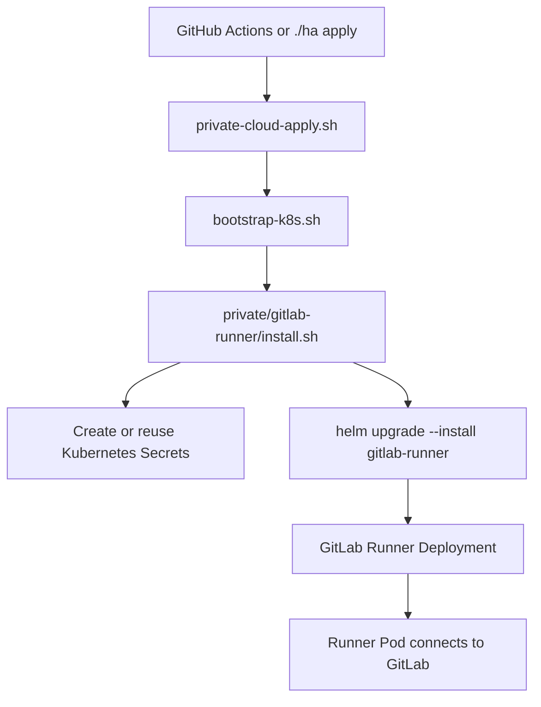
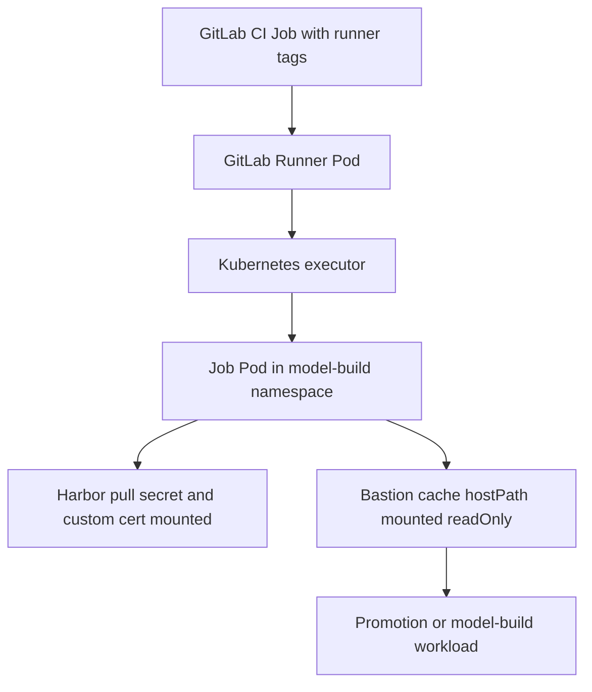

# GitLab Runner Provisioning

Private Kubernetes 환경에 GitLab Runner를 자동 등록·설치하기 위한 코드입니다. 이 Runner는 Harbor에서 생성된 이미지를 후속 GitLab CI 파이프라인이 수신하고, Harbor → ECR promotion 같은 model-build 계열 작업을 Kubernetes executor로 실행하는 용도입니다.

## 목적

- `model-build` namespace에 GitLab Runner를 Helm chart로 일관되게 배포합니다.
- live 환경의 Runner 설정을 레포 안의 명시적인 `values.yaml`로 관리합니다.
- 실제 token은 Secret 또는 환경변수 주입으로만 다루고, 레포에는 커밋하지 않습니다.

## 현재 구조

기존에는 `private/kubernetes-bootstrap/bootstrap-k8s.sh` 안에서 `helm --set`으로 Runner를 직접 설치했습니다. 이제는 `private/gitlab-runner/values.yaml`과 `private/gitlab-runner/install.sh`로 분리해 설정과 설치 절차를 독립적으로 유지합니다.

주요 파일:

- `values.yaml`: live 기준 Runner 설정
- `install.sh`: Secret 확인/생성, Helm install/upgrade, rollout 확인
- `runner-secret.example.yaml`: Runner token Secret 예시
- `harbor-pull-secret.example.yaml`: Harbor pull secret 예시
- `gitlab-runner-certs.example.yaml`: GitLab custom cert secret 예시

## 동작 흐름

1. GitHub Actions 또는 `./ha apply`가 private cloud apply 흐름을 시작합니다.
2. `private/ci/private-cloud-apply.sh`가 Kubernetes bootstrap 단계를 호출합니다.
3. `private/kubernetes-bootstrap/bootstrap-k8s.sh`가 control-plane에서 사용할 GitLab host alias IP와 cert secret을 준비합니다.
4. `private/gitlab-runner/install.sh`가 namespace, runner Secret, Harbor pull secret, cert secret을 확인합니다.
5. `helm upgrade --install`이 `gitlab/gitlab-runner` chart `0.89.1`을 `model-build` namespace에 배포합니다.
6. GitLab Runner Pod가 GitLab에 연결되고, GitLab CI Job을 수신합니다.
7. Kubernetes executor가 `model-build` namespace에 Job Pod를 생성합니다.

## Provisioning Flow



## Runner Job Flow



## Secret Handling

- 실제 Runner token은 `GITLAB_RUNNER_AUTH_TOKEN` 환경변수로만 전달합니다.
- `install.sh`는 `gitlab-runner` Secret의 `runner-token` key를 생성 또는 갱신합니다.
- chart 호환성을 위해 `runner-registration-token` key도 비워 둔 채 함께 유지합니다.
- 예시 YAML에는 `REPLACE_ME`와 `base64-placeholder`만 포함합니다.

권장 적용 예시:

```bash
kubectl -n model-build create secret generic gitlab-runner \
  --from-literal=runner-token="$GITLAB_RUNNER_AUTH_TOKEN" \
  --from-literal=runner-registration-token="" \
  --dry-run=client -o yaml | kubectl apply -f -
```

## 운영 메모

- 기본 host alias IP는 `100.110.101.77`이며, bootstrap 단계에서 탐지한 IP로 override할 수 있습니다.
- 기본 node selector는 `kubernetes.io/hostname=hybrid-ai-private-build-01`입니다.
- Runner tag는 `gpu-worker,private,ecr-sync,model-build`를 기본으로 사용합니다.
